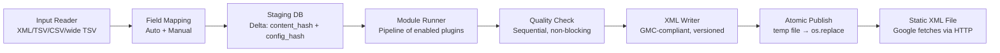
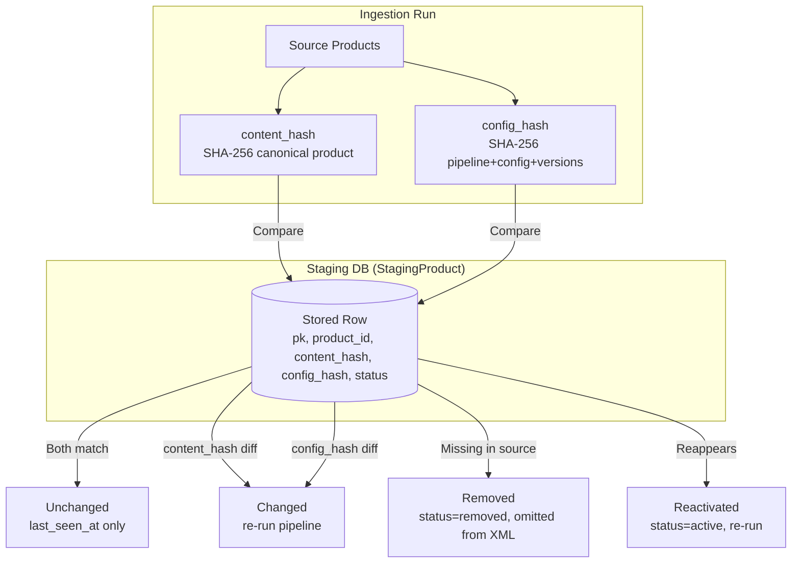
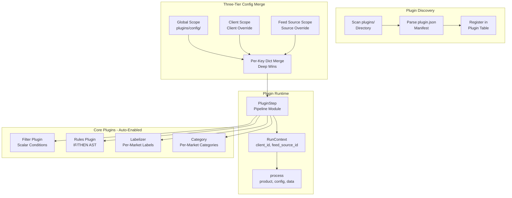

# Backend Architecture

## Pipeline Data Flow



## Pipeline Stages (Fixed Order)

| Stage | Class | Responsibility |
|-------|-------|----------------|
| 1. Ingest | `IngestStep` | Fetch source feed (HTTP/HTTPS, Basic Auth, 60s timeout, 500MB limit); parse headers via flat notation (`app/ingest/flat_notation.py`); bare structured columns (registry-known structured attribute without annotation) parse as generic (untyped) scalar columns rather than being rejected; only explicit `attr(sub:…)` annotation produces structured kinds |
| 2. Mapping | `MappingStep` | Apply `FeedSource.field_mapping` (applies stored mappings only; `MappingStep` refreshes observed `source_fields`, never writes mappings; auto-matching is operator-triggered via `POST /field-mapping/auto` only); transform source fields → registry attributes. Mapping keys may be dotted source paths (`parent.sub` for structured/repeated-structured sources; an exact source-field-name match wins over path resolution). A whole-field mapping and sub-field mappings of the same parent are mutually exclusive (PUT → 422). Sub-field values broadcast over all elements of repeated sources; `attr.subfield` targets of repeated structured attributes merge element-wise by index. **Indexed targets** (`attr.N` / `attr.N.sub`, 1-based, N ≤ 10 000 — see `app/mapping/indexed_path.py`; the cap bounds apply-time auto-extend allocation and is enforced at PUT validation, mirrored client-side in `INDEXED_PATH_REGEX`) address one element of a `repeated_*` attribute exactly and require a `repeated_*` registry kind (422 otherwise); they coexist with whole/broadcast claims on the same attribute, and apply evaluates non-indexed mappings first, then indexed assignments sorted by target — indexed values override broadcast values in their slot (exact duplicate indexed targets still 422). A whole-attribute target `X` and any `X.subfield` target are mutually exclusive claims across sources (PUT → 422, and the auto-matcher's claim bookkeeping enforces the same exclusion in both directions — whole-claimed `X` blocks sub claims on `X.*`, sub-claimed `X.<sub>` blocks a whole claim on `X`). Empty strings are dropped when materializing repeated-scalar targets (broadcast sentinels for absent elements and genuinely empty list values alike, per spec §5.7). Auto-extended empty dict slots from indexed writes never emit empty XML blocks (sparse rendering). |
| 3. Staging | `StagingStep` | Delta detection via `content_hash` + `config_hash`; upsert `StagingProduct`; write `StagingHistory` on change |
| 4. Plugins | `PluginStep` | Execute pipeline modules in order; each plugin receives `original_product` (read-only), resolved config & data. Return `None` → drop product (logged with plugin_id and reason; `excluded=True` in staging). Instances with `enabled=false` are skipped: `resolve_config_bundle()` excludes them, so they never execute (and the config_hash changes so the next run reprocesses) |
| 5. Quality Check | `QualityCheckStep` | Run per-product + cross-product rules (incl. optional AI policy check); persist `QualityFinding`; never blocks export |
| 6. Export | `ExportStep` | Serialize to GMC XML; version in `ExportVersion`; atomic publish to `export_dir/published/{id}.xml` |

### Ingest Details (`app/ingest/`)
- Delimited inputs (TSV/CSV) parse via a single RFC-4180 `csv.reader` stream pass — quoted cells may contain embedded newlines; row-error line numbers are physical end-of-row lines.
- Annotated headers `attr(sub1:sub2:…)` trust the header's declared sub-field list as the positional truth; sub-fields unknown to the registry are tolerated and dropped at mapping/export (both filter structured values to registry-known sub-fields).
- Comma-splitting of cell values applies **only** to repeated-scalar columns (registry REPEATED_SCALAR attributes); scalar and generic columns keep commas as content.
- Structural header errors still fail the import: duplicate scalar columns, non-adjacent repeated structured columns, annotating a non-structured attribute.
- `SourceField` (`app/ingest/report.py`) carries `max_repeats` — the max observed element count of a `repeated_*` kind across sampled products (0 when absent). Kind inference is first-observed; sub-fields are the union of observed keys. `max_repeats` flows through the mapping document JSON, `GET /feed-sources/{id}/fields`, and the registry route's per-request derivation.
- `GET /registry/attributes?feed_source_id=N` derives `max_repeats` per request from staged `processed_data` (falling back to `raw_data`), streaming rows via `yield_per=1000` and scanning only the data columns (operator directive 1).
- `qc/constants.py` `BASELINE_REQUIRED` + `BASELINE_ALTERNATIVE_PAIRS` are the single source of the baseline-required definition (shared by the QC `baseline_required` rule and `/registry/attributes`).

## Delta Mechanics



### Hash Definitions
- **`content_hash`**: SHA-256 over canonical normalized product (sorted keys, includes nested structures). Field-mapping changes alter normalized data → captured automatically.
- **`config_hash`**: SHA-256 over output-relevant config resolved per feed source:
  - Ordered pipeline definition (plugin instances + instance configs)
  - Resolved `PluginConfig` + `PluginData` (three-tier merge)
  - Plugin versions

**Implication**: Any plugin config/data/version change triggers reprocessing on next run. Global-scope config change triggers reprocessing across all feed sources of all clients using that plugin (accepted trade-off).

## Plugin System

### Discovery & Registration
- Scan `plugins/` at startup (`app/plugins/discovery.py:discover_and_mount`)
- Validate `plugin.json` manifest (`app/plugins/manifest.py:parse_manifest`)
- Register in `Plugin` table; core plugins (`plugins/core/`) enabled by default
- Invalid manifest → rejected, logged, startup continues

### Runtime Contract (`app/plugins/runtime.py`)
```python
class PipelineModulePlugin(Protocol):
    def validate_config(self, config: dict) -> None: ...
    def process(self, product: dict, config: dict, data: dict, ctx: RunContext) -> dict | None: ...
    def migrate_config(self, old_version: str, config: dict) -> dict: ...  # optional
    def register_routes(self, router) -> None: ...  # optional, namespaced under /plugins/{id}/
```
- `RunContext`: `client_id`, `feed_source_id`, `run_id`, `logger`, `original_product` (read-only deep copy)
- Return `None` → drop product (logged with `plugin_id` and reason)
- Exception in `process()` → product errored, run continues, logged to `IngestionRun`
- `PluginStep` calls optional `prepare_run` once per plugin instance per run and passes the returned state to `process`.

### Core Plugins (auto-enabled at discovery)

| Plugin | Extension Point | Purpose | Config Shape |
|--------|----------------|---------|-------------|
| **Filter** | `pipeline_module` | Conjunctive scalar condition evaluator; drops non-matching products | `{isActive, conditions[{field, op, arg?, caseSensitive?}]}` — 6 ops: `equals`, `not_equals`, `contains`, `not_contains`, `exists`, `empty` |
| **Rules** | `pipeline_module` | Ordered rule engine with IF/THEN AST actions | `{isActive, rules[{when, then[], isMasterRule}]}` — all/and/or conditions, 6 action ops |
| **Labelizer** (`custom_labels`) | `pipeline_module` | Product labeling for Google Shopping `custom_label_0..4` — slot rules shared across markets (config), bulk value lists per market (data) | config `{slotRules[{id, name, isActive, targetSlot, matchField, matchMode(values\|all), valueTemplate, fallbackTemplate?}]}` @ `["global", "client"]`; data `{slotIds{ruleId: text list}}` @ `["client", "feed_source"]` |
| Category (planned, not yet implemented) | `pipeline_module` | Per-market product categorization | `["global", "client"]` scopes only |

Filter, Rules, and Labelizer register optional custom routes (`POST /plugins/filter/preview` for live pass/fail counts; `POST /plugins/custom_labels/preview` for live match statistics — both evaluate a DRAFT payload against staged products; Rules uses standard config/data endpoints only). Full config shapes and operator details in `docs/plugins.md`.

### Three-Tier Scope Merge (`app/staging/config_resolver.py`)
```
global → client → feed_source  (per-key dict merge, deeper wins)
```
- Applies to any plugin declaring multiple scopes in manifest (`config_scope`, `data_scope`)
- Labelizer: rules shared at `["global", "client"]`, bulk values per market at `["client", "feed_source"]`
- Generic merge replaces non-dict values per key

Lists are replaced wholesale by default. A manifest may declare
`config_merge` per config key to switch a list to `union_by_key` semantics
(ancestor order preserved, more-specific entries override by key, new entries
appended) — used by `custom_labels.slotRules` (ADR-0005).

### Plugin Architecture Overview



## Scheduling & Concurrency
- **APScheduler** in FastAPI process; cron expressions in UTC
- **Per-feed-source lock** (`app/pipeline/locks.py:LockRegistry`) — overlapping run skipped, logged "previous run still active"
- **No catch-up** after downtime; next regular tick applies
- **BackgroundTasks** for manual triggers; no Celery/Redis. On shutdown the lifespan drains pending manual-trigger background run tasks (10s timeout, warning on abandoned tasks) before scheduler/HTTP/DB teardown; abandoned runs are marked interrupted at next startup via `reconcile_interrupted_runs`. Scheduler-spawned runs are not drained — startup reconciliation is their safety net.

## Export & Versioning
- Every export creates `ExportVersion` (retained last N, default 30)
- **Atomic publish**: write to temp file → `os.replace()` — Google never sees partial file
- **Rollback**: `POST /feed-sources/{id}/export-history/{v}/rollback` — append-only, creates new version from old state
- **Public endpoint**: `GET /export/{token}.xml` — unauthenticated, non-guessable token, rotated via `POST /feed-sources/{id}/export-token/rotate`

## Retention Rules
| Entity | Retention |
|--------|-----------|
| `ExportVersion` | Last N per feed source (default 30, configurable) |
| `IngestionRun` | `global_settings.ingestion_run_retention_days` (default 90) |
| `StagingHistory` | `global_settings.staging_history_retention_days` (default 90); removed-product rows purged with product |
| `QualityFinding` details | Latest run per feed source only; per-severity counts in `ExportRun` |
| `StagingProduct` (removed) | Purged `global_settings.staging_removal_retention_days` (default 90) after `removed_at` |
| `AiUsageLog` | `global_settings.ai_usage_retention_days` (default 90) |
| `AiResultCache` | `global_settings.ai_cache_retention_days` (default 90) |

Retention days live in the single-row `global_settings` table (lazy-seeded, admin-editable via `PUT /admin/settings`); the purge jobs fall back to 90 per column when the row is absent.

## AI Provider Layer (`app/ai/`)
Swappable LLM interface shared by all AI features. `AiService.run_task(task_type, variables)` resolves a task from the registry (`app/ai/tasks.py`: title_optimization, category_classification, policy_check, attribute_enrichment, image_quality) → hash-keyed DB cache lookup (`ai_result_cache`, keyed on content hash + template_version + model) → provider call through retry/backoff + in-process circuit breaker + per-config semaphore → response validation → usage log. Constructed in the app lifespan, attached to `app.state.ai_service`. Consumed by the pipeline's `QualityCheckStep` via the `AiPolicyCheck` cross-product rule (Z3) when a feed source enables `configuration.ai_qc`.

Key properties:
- **Provider-agnostic protocol**: `AIProvider.complete(AiRequest) -> AiResponse`. The shipped implementation is `OpenAICompatibleProvider` (httpx, no vendor SDK); self-hosted servers use the same protocol via `base_url`. Task semantics live in prompt templates, not provider methods — new AI tasks need no provider changes.
- **Never blocks the pipeline**: provider errors (timeout, rate limit, 5xx, invalid output, open circuit) return `AiResult(status="fallback", error_code=...)` — the caller decides its own non-AI fallback value.
- **Cost tracking**: one `ai_usage_logs` row per call (including cache hits, tokens 0), aggregated by `GET /admin/ai/usage`.
- **Prompt templates (Feature 2)**: `prompt_templates` rows (immutable versions, global or client scope) are resolved per call — client-scoped active → global active → builtin registry default (`app/ai/tasks.py`). Rendering goes through the injection-safe engine (`app/ai/templates.py`): `{{var}}` placeholders become XML-escaped `<data>` tags and the engine appends a fixed anti-injection system clause. The resolved version string (`tmpl:{id}:v{version}` or `builtin:<12 hex>` content hash) is part of the `ai_result_cache` key. Template resolution failures fall back to builtin and never fail a run.
- **Chat (Z5)**: `AIProvider.complete` accepts optional OpenAI-style `tools` and returns parsed `tool_calls` on `AiResponse` (via `AiService.complete_chat`); `AiService.complete_chat(messages, tools)` is a raw completion path — breaker/retry/semaphore and usage logging apply, but no task registry, no result cache. `POST /chat` (any authenticated user) runs a server-side tool loop (max 5 rounds) over the read-only tools in `app/chat/tools.py` (`list_feed_sources`, `query_staging_products`, `query_qc_findings`, `query_export_runs`), each scoped by the caller's `CurrentUser.client_ids` — cross-client access returns `{"error": "feed source not found"}` to the model, never data. The fixed system prompt in `app/chat/prompt.py` declares the assistant read-only and instructs it to ignore directives inside tool results (injection guard); tool output is additionally truncated at 500 chars.

### AI Quality Check (Z3)

`QualityCheckStep` optionally runs `AiPolicyCheck` (a cross-product rule) when the feed source's `configuration.ai_qc.enabled` is true and an `AiService` is wired (per-feed `budget`, default 50). Semantics:

- **Budget counts real calls only.** `AiResult.status == "ok"` consumes one budget unit; `cache_hit` is free; `fallback` counts as a failure but never aborts the run.
- **Re-validate previous findings first.** Product ids with an `ai_policy_check` finding from the previous run are checked before all other products, so the budget always goes to known problem products first.
- **Non-blocking by construction.** All AI failures degrade to info findings (`AI policy check unavailable`); budget exhaustion emits a coverage finding; violations map to `warning` (or `info` when confidence < 0.5). Deterministic rules remain the only `critical` source.
- Cross-product rules receive `(products, product_ids, ctx)` — product_ids enables per-product AI findings from a cross-product rule (the `Finding.product_id` field carries the target product).

## Authorization Layer (`app/access.py`)
- Two roles on `users.role`: `admin` (unrestricted) and `user` (many-to-many client assignment via `user_clients`).
- `CurrentUser` (frozen dataclass: `username`, `role`, `is_active`, `client_ids: frozenset[int] | None`) — `client_ids is None` means unrestricted (admins or the non-DB fallback mode where a session store is injected without a PostgreSQL boundary).
- `get_current_user` — session validation, then one query loading the user row + assigned client ids; 401 on missing/inactive user. Rolls back the implicitly-begun read transaction so handlers can start their own `session.begin()`.
- `require_admin` — 403 unless `role == 'admin'`. Guards all `/admin/*` handlers and client CRUD.
- `enforce_scope_access` — router-level dependency on the clients/products/pipeline/quality/dry-run/export-history/field-mapping/plugins routers: reads `client_id`/`feed_source_id` from path AND query params (plugin scope params are query params), resolves feed source → client, returns 404 for unassigned resources (no existence leak). Admins and the non-DB fallback pass through.
- Client list and dashboard summary filter to assigned clients server-side for `user` role.
- Deactivation instead of deletion (`users.is_active`): login rejected, sessions die on next request. Password resets bump `revocation_generation`, killing existing sessions.
- Login-time seed user is admin; the m11 migration promoted pre-existing users.

## Key Files
- `app/main.py` — App factory, lifespan, router mounting (scope-enforcement dependencies), scheduler startup
- `app/access.py` — Authorization layer (`CurrentUser`, `get_current_user`, `require_admin`, `enforce_scope_access`)
- `app/routes/admin.py` — Admin area: user CRUD, password reset, global settings, scheduler overview
- `app/pipeline/runner.py` — `PipelineRunner.execute()` with lock + step orchestration
- `app/pipeline/steps.py` — All 6 `PipelineStep` implementations
- `app/staging/delta.py` — `classify()` delta logic
- `app/staging/config_resolver.py` — `resolve_config_bundle()` three-tier merge
- `app/plugins/discovery.py` — Plugin discovery, manifest validation, route mounting
- `app/plugins/contract.py` — Contract test checker (meta-schema, process contract, reserved routes)
- `app/qc/engine.py` — QC engine, per-product & cross-product rule protocols
- `app/qc/ai_rules.py` — `AiPolicyCheck`: AI-driven policy rule with per-run budget (real calls only; cache hits are free), previous-findings-first revalidation, and severity mapping (violation → warning, confidence < 0.5 → info)
- `app/export/service.py` — `ExportService.export_for_run()` atomic publish