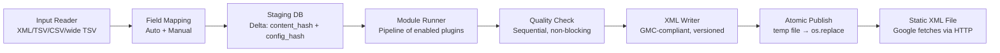
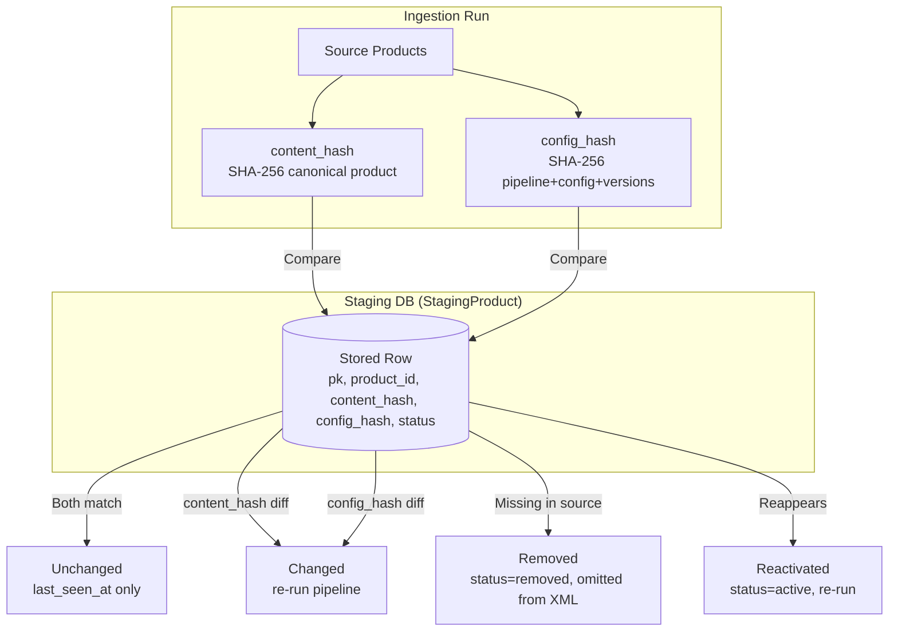

# Backend Architecture

## Pipeline Data Flow



## Pipeline Stages (Fixed Order)

| Stage | Class | Responsibility |
|-------|-------|----------------|
| 1. Ingest | `IngestStep` | Fetch source feed (HTTP/HTTPS, Basic Auth, 60s timeout, 500MB limit); parse headers via flat notation (`app/ingest/flat_notation.py`); bare structured columns (registry-known structured attribute without annotation) parse as generic (untyped) scalar columns rather than being rejected; only explicit `attr(sub:…)` annotation produces structured kinds |
| 2. Mapping | `MappingStep` | Apply `FeedSource.field_mapping` (auto-mapped on first run); transform source fields → registry attributes. Mapping keys may be dotted source paths (`parent.sub` for structured/repeated-structured sources; an exact source-field-name match wins over path resolution). A whole-field mapping and sub-field mappings of the same parent are mutually exclusive (PUT → 422). Sub-field values broadcast over all elements of repeated sources; `attr.subfield` targets of repeated structured attributes merge element-wise by index. |
| 3. Staging | `StagingStep` | Delta detection via `content_hash` + `config_hash`; upsert `StagingProduct`; write `StagingHistory` on change |
| 4. Plugins | `PluginStep` | Execute pipeline modules in order; each plugin receives `original_product` (read-only), resolved config & data |
| 5. Quality Check | `QualityCheckStep` | Run per-product + cross-product rules; persist `QualityFinding`; never blocks export |
| 6. Export | `ExportStep` | Serialize to GMC XML; version in `ExportVersion`; atomic publish to `export_dir/published/{id}.xml` |

### Ingest Details (`app/ingest/`)
- Delimited inputs (TSV/CSV) parse via a single RFC-4180 `csv.reader` stream pass — quoted cells may contain embedded newlines; row-error line numbers are physical end-of-row lines.
- Annotated headers `attr(sub1:sub2:…)` trust the header's declared sub-field list as the positional truth; sub-fields unknown to the registry are tolerated and dropped at mapping/export (both filter structured values to registry-known sub-fields).
- Comma-splitting of cell values applies **only** to repeated-scalar columns (registry REPEATED_SCALAR attributes); scalar and generic columns keep commas as content.
- Structural header errors still fail the import: duplicate scalar columns, non-adjacent repeated structured columns, annotating a non-structured attribute.
- `qc/constants.py` `BASELINE_REQUIRED` + `BASELINE_ALTERNATIVE_PAIRS` are the single source of the baseline-required definition (shared by the QC `baseline_required` rule and `/registry/attributes`).

## Delta Mechanics



### Hash Definitions
- **`content_hash`**: SHA-256 over canonical normalized product (sorted keys, includes nested structures). Field-mapping changes alter normalized data → captured automatically.
- **`config_hash`**: SHA-256 over output-relevant config resolved per feed source:
  - Ordered pipeline definition (plugin instances + instance configs)
  - Resolved `PluginConfig` + `PluginData` (three-tier merge)
  - Plugin versions

**Implication**: Any plugin config/data/version change triggers reprocessing on next run. Global-scope config change triggers reprocessing across all feed sources of all clients using that plugin (accepted trade-off).

## Plugin System

### Discovery & Registration
- Scan `plugins/` at startup (`app/plugins/discovery.py:discover_and_mount`)
- Validate `plugin.json` manifest (`app/plugins/manifest.py:parse_manifest`)
- Register in `Plugin` table; core plugins (`plugins/core/`) enabled by default
- Invalid manifest → rejected, logged, startup continues

### Runtime Contract (`app/plugins/runtime.py`)
```python
class PipelineModulePlugin(Protocol):
    def validate_config(self, config: dict) -> None: ...
    def process(self, product: dict, config: dict, data: dict, ctx: RunContext) -> dict | None: ...
    def migrate_config(self, old_version: str, config: dict) -> dict: ...  # optional
    def register_routes(self, router) -> None: ...  # optional, namespaced under /plugins/{id}/
```
- `RunContext`: `client_id`, `feed_source_id`, `run_id`, `logger`, `original_product` (read-only deep copy)
- Return `None` → drop product (logged with `plugin_id` and reason)
- Exception in `process()` → product errored, run continues, logged to `IngestionRun`

### Three-Tier Scope Merge (`app/staging/config_resolver.py:merge_scopes`)
```
global → client → feed_source  (per-key dict merge, deeper wins)
```
- Applies to any plugin declaring multiple scopes in manifest (`config_scope`, `data_scope`)
- Labelizer & Category: `["global", "client"]` only (deliberate, per-market labeling/categorization out of MVP)
- Generic merge replaces non-dict values per key; plugins needing finer-grained list merging implement custom logic (Labelizer dimensions)

## Scheduling & Concurrency
- **APScheduler** in FastAPI process; cron expressions in UTC
- **Per-feed-source lock** (`app/pipeline/locks.py:LockRegistry`) — overlapping run skipped, logged "previous run still active"
- **No catch-up** after downtime; next regular tick applies
- **BackgroundTasks** for manual triggers; no Celery/Redis. On shutdown the lifespan drains pending manual-trigger background run tasks (10s timeout, warning on abandoned tasks) before scheduler/HTTP/DB teardown; abandoned runs are marked interrupted at next startup via `reconcile_interrupted_runs`. Scheduler-spawned runs are not drained — startup reconciliation is their safety net.

## Export & Versioning
- Every export creates `ExportVersion` (retained last N, default 30)
- **Atomic publish**: write to temp file → `os.replace()` — Google never sees partial file
- **Rollback**: `POST /feed-sources/{id}/export-history/{v}/rollback` — append-only, creates new version from old state
- **Public endpoint**: `GET /export/{token}.xml` — unauthenticated, non-guessable token, rotated via `POST /feed-sources/{id}/export-token/rotate`

## Retention Rules
| Entity | Retention |
|--------|-----------|
| `ExportVersion` | Last N per feed source (default 30, configurable) |
| `IngestionRun` | 90 days |
| `StagingHistory` | 90 days; removed-product rows purged with product |
| `QualityFinding` details | Latest run per feed source only; per-severity counts in `ExportRun` |
| `StagingProduct` (removed) | Purged 90 days after `removed_at` |

## Key Files
- `app/main.py` — App factory, lifespan, router mounting, scheduler startup
- `app/pipeline/runner.py` — `PipelineRunner.execute()` with lock + step orchestration
- `app/pipeline/steps.py` — All 6 `PipelineStep` implementations
- `app/staging/delta.py` — `classify()` delta logic
- `app/staging/config_resolver.py` — `resolve_config_bundle()` three-tier merge
- `app/plugins/discovery.py` — Plugin discovery, manifest validation, route mounting
- `app/plugins/contract.py` — Contract test checker (meta-schema, process contract, reserved routes)
- `app/qc/engine.py` — QC engine, per-product & cross-product rule protocols
- `app/export/service.py` — `ExportService.export_for_run()` atomic publish