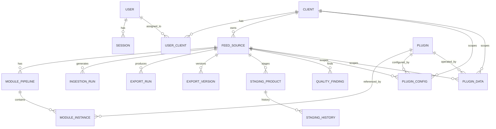

# Backend Data Model

## Entity Relationship Diagram



## Core Entities

### User
| Column | Type | Notes |
|--------|------|-------|
| `id` | Integer | PK |
| `username` | String(255) | Unique |
| `password_hash` | String(512) | Argon2 |
| `revocation_generation` | Integer | Bumped on password change → all sessions die |
| `role` | String(20) | `admin` / `user` (NOT NULL, default `user`) |
| `is_active` | Boolean | NOT NULL, default true; false → login rejected (401), sessions die |
| `created_at` | DateTime | |
| `updated_at` | DateTime | |

Seeded from `INITIAL_USERNAME` / `INITIAL_PASSWORD` env vars on first start — the seed user is `admin`. The m11 migration promoted all pre-existing users to `admin`. Users are deactivated, never deleted (FK/session integrity, run attribution).

### UserClient (client assignment)
| Column | Type | Notes |
|--------|------|-------|
| `id` | Integer | PK |
| `user_id` | Integer | FK → User, CASCADE |
| `client_id` | Integer | FK → Client, CASCADE |

Unique `(user_id, client_id)`. Many-to-many: a `user` sees only their assigned clients; `admin` is unrestricted (no rows needed).

### GlobalSetting
| Column | Type | Notes |
|--------|------|-------|
| `id` | Integer | PK, fixed value 1 (single row) |
| `staging_removal_retention_days` | Integer | Default 90 |
| `staging_history_retention_days` | Integer | Default 90 |
| `ingestion_run_retention_days` | Integer | Default 90 |
| `ai_usage_retention_days` | Integer | Default 90 |
| `event_log_retention_days` | Integer | Default 180 |
| `ai_cache_type` | String(20) | `local` or `disk` (redis is selected by env) |
| `ai_cache_namespace` | String(100) | Cache-key namespace prefix, default `gmc-ai` |
| `ai_cache_ttl_taxonomy_s` | Integer | Taxonomy-task cache TTL, default 2592000 |
| `ai_cache_ttl_content_s` | Integer | Content-task cache TTL, default 604800 |
| `ai_router_timeout_s` | Integer | LiteLLM Router per-request timeout, default 30 |
| `ai_router_num_retries` | Integer | Default 2 |
| `ai_router_allowed_fails` | Integer | Default 3 |
| `ai_router_cooldown_s` | Integer | Default 30 |
| `ai_instructor_max_retries` | Integer | Default 2 |
| `updated_at` | DateTime | |

Row is seeded lazily on first `GET /admin/settings` (the migration does not insert it). The nightly purge jobs read these values; fallback is 90 days per column while no row exists. Editable via `PUT /admin/settings` (retention) and `GET/PUT /admin/ai/settings` (the `ai_*` columns, hot-applied to the running AI service).

### Client
| Column | Type | Notes |
|--------|------|-------|
| `id` | Integer | PK |
| `name` | String(255) | |
| `settings` | JSONB | Client-level settings |
| `contact_details` | JSONB | Contact information |
| `status` | String(50) | `active` / `inactive` |
| `created_at` | DateTime | |
| `updated_at` | DateTime | |

### FeedSource
| Column | Type | Notes |
|--------|------|-------|
| `id` | Integer | PK |
| `client_id` | Integer | FK → Client, RESTRICT |
| `active_pipeline_id` | Integer | FK → ModulePipeline, RESTRICT, nullable |
| `name` | String(255) | |
| `source_format` | String(50) | `xml`, `tsv`, `csv`, `wide_tsv` |
| `cron_expression` | String(100) | UTC, nullable |
| `target_country` | String(10) | ISO 3166-1 alpha-2 |
| `target_language` | String(10) | ISO 639-1 |
| `currency` | String(3) | ISO 4217 |
| `feed_type` | String(20) | `primary` (MVP), `supplemental` (future) |
| `export_token` | String(64) | Unique, `secrets.token_urlsafe(32)` |
| `history_retention_count` | Integer | Default 30 |
| `source_url` | String(2048) | HTTP(S) fetch URL |
| `volume_drop_threshold_pct` | Integer | Default 20 |
| `field_mapping` | JSONB | Source field → registry attribute path; targets use the 1-based indexed grammar `attr \| attr.sub \| attr.N \| attr.N.sub` (N ≤ 10 000, enforced at PUT validation) |
| `configuration` | JSONB | Feed-specific config. Known keys: `basic_auth` (`{username, password}`), `ai_qc` (`{enabled: bool, budget: int}` — enables the AI policy check QC rule, budget = real AI calls per run, default 50) |
| `created_at` / `updated_at` | DateTime | Auto |

### ModulePipeline
| Column | Type | Notes |
|--------|------|-------|
| `id` | Integer | PK |
| `feed_source_id` | Integer | FK → FeedSource, RESTRICT |
| `name` | String(255) | |
| `version` | String(100) | Semantic version |
| `definition` | JSONB | Mirrors the `ModuleInstance` rows: `{instances: [{plugin_id, name, configuration, enabled}]}` (string manifest plugin ids). Rebuilt on every PUT/PATCH of the pipeline |
| `created_at` | DateTime | |

Unique constraint on `(name, version)`.

### ModuleInstance
| Column | Type | Notes |
|--------|------|-------|
| `id` | Integer | PK |
| `pipeline_id` | Integer | FK → ModulePipeline, RESTRICT |
| `plugin_id` | Integer | FK → Plugin, RESTRICT |
| `position` | Integer | Order in pipeline |
| `enabled` | Boolean | Per-feed-source per-instance toggle, default true; `false` → excluded from the config bundle (never executed) and `config_hash` changes so the next run reprocesses |
| `name` | String(255) | Display name |
| `configuration` | JSONB | Instance-specific config |

Unique constraint on `(pipeline_id, position)`.

### Plugin
| Column | Type | Notes |
|--------|------|-------|
| `id` | Integer | PK |
| `name` | String(255) | Manifest `id` |
| `version` | String(100) | Manifest `version` |
| `manifest` | JSONB | Full parsed manifest |
| `enabled` | Boolean | Global toggle, default false (core=true) |
| `created_at` | DateTime | |

Unique constraint on `(name, version)`.

### PluginConfig / PluginData
| Column | Type | Notes |
|--------|------|-------|
| `id` | Integer | PK; doubles as the optimistic-lock revision token (PUTs are delete+insert, so the id strictly increases per write — see api.md `expected_version`) |
| `plugin_id` | Integer | FK → Plugin, RESTRICT |
| `scope` | String(50) | `global` / `client` / `feed_source` |
| `client_id` | Integer | FK → Client, nullable |
| `feed_source_id` | Integer | FK → FeedSource, nullable |
| `key` | String(255) | Logical key (default `"default"`) |
| `config` / `data` | JSONB | Validated against manifest schema |
| `created_at` | DateTime | PluginData only (PluginConfig has no `created_at`) |

**Scope constraints** (enforced by DB):
- `global`: `client_id IS NULL AND feed_source_id IS NULL`
- `client`: `client_id NOT NULL AND feed_source_id IS NULL`
- `feed_source`: `client_id IS NULL AND feed_source_id NOT NULL`

### StagingProduct
| Column | Type | Notes |
|--------|------|-------|
| `id` | Integer | PK |
| `feed_source_id` | Integer | FK → FeedSource |
| `ingestion_run_id` | Integer | FK → IngestionRun |
| `product_id` | String(255) | Source product ID |
| `content_hash` | String(64) | SHA-256 canonical product |
| `config_hash` | String(64) | SHA-256 resolved pipeline config |
| `status` | String(20) | `active` / `removed` |
| `last_seen_at` | DateTime | Updated every run |
| `removed_at` | DateTime | Set when status=removed |
| `raw_data` | JSONB | Post-mapping, pre-pipeline |
| `processed_data` | JSONB | Post-pipeline (export candidate) |
| `excluded` | Boolean | Dropped by plugin (Filter, etc.) |

### StagingHistory
| Column | Type | Notes |
|--------|------|-------|
| `id` | Integer | PK |
| `staging_product_id` | Integer | FK → StagingProduct |
| `snapshot` | JSONB | Full product snapshot at change |
| `recorded_at` | DateTime | |

Written only when `content_hash` changes.

### IngestionRun
| Column | Type | Notes |
|--------|------|-------|
| `id` | Integer | PK |
| `feed_source_id` | Integer | FK → FeedSource |
| `status` | String(20) | `running` / `success` / `error` / `skipped` / `pending` |
| `processed_count` | Integer | |
| `failed_count` | Integer | Row errors + plugin errors |
| `statistics` | JSONB | Per-step stats |
| `error_message` | String(4000) | Truncated |
| `error_stack_trace` | String(20000) | Truncated |
| `started_at` | DateTime | |
| `completed_at` | DateTime | Nullable |

Retention: 90 days.

### ExportRun
| Column | Type | Notes |
|--------|------|-------|
| `id` | Integer | PK |
| `feed_source_id` | Integer | FK → FeedSource |
| `export_version_id` | Integer | FK → ExportVersion, nullable (SET NULL on purge) |
| `ingestion_run_id` | Integer | FK → IngestionRun, nullable (SET NULL on purge) |
| `status` | String(50) | Run status |
| `product_count` | Integer | Exported products |
| `critical_finding_count` | Integer | |
| `warning_finding_count` | Integer | |
| `info_finding_count` | Integer | |
| `fixed_finding_count` | Integer | Findings present in the prior run, absent in this one (delta key `(code, product_id, field)`) |
| `new_finding_count` | Integer | Findings absent in the prior run, present in this one |
| `remaining_finding_count` | Integer | Findings present in both runs (a message-only change counts as remaining) |
| `options` | JSONB | Export options |
| `started_at` | DateTime | |
| `completed_at` | DateTime | Nullable; set when run finishes |

### ExportVersion
| Column | Type | Notes |
|--------|------|-------|
| `id` | Integer | PK |
| `feed_source_id` | Integer | FK → FeedSource |
| `export_run_id` | Integer | FK → ExportRun |
| `version_number` | Integer | Sequential per feed source |
| `file_hash` | String(64) | Content hash of the export file |
| `product_count` | Integer | Products in this version |
| `source` | String(20) | `scheduled`, `manual`, or `rollback` (spec §4.7; default `manual`; scheduler-invoked runs write `scheduled`) |
| `source_version_id` | Integer | FK → ExportVersion, nullable (SET NULL); rollback lineage |
| `created_at` | DateTime | |

Retention: Last N per feed source (default 30, includes rollback versions).

### QualityFinding
| Column | Type | Notes |
|--------|------|-------|
| `id` | Integer | PK |
| `feed_source_id` | Integer | FK → FeedSource |
| `ingestion_run_id` | Integer | FK → IngestionRun |
| `product_id` | String(255) | Empty for cross-product rules |
| `rule_id` | String(100) | QC rule identifier |
| `severity` | String(20) | `critical` / `warning` / `info` |
| `field` | String(255) | Affected attribute path |
| `message` | String(1000) | |
| `details` | JSONB | Additional context |
| `created_at` | DateTime | |

**Retention**: Detail rows for latest run only; counts persisted in `ExportRun`.

### AiProviderConfig
| Column | Type | Notes |
|--------|------|-------|
| `id` | Integer | PK |
| `name` | String(255) | Unique label |
| `provider_type` | String(50) | `litellm` or legacy `openai_compatible` (mapped to `openai/<model>` at Router build) |
| `base_url` | String(1024) | OpenAI or self-hosted (vLLM/Ollama/LM Studio) |
| `api_key` | String(1024) | Write-only via API; redacted in all responses and logs |
| `model` | String(255) | LiteLLM model id, e.g. `openai/gpt-4o-mini`, `anthropic/claude-3-5-sonnet` |
| `tier` | String(20) | `bulk` or `precision` — the Router model group the row joins |
| `input_price_per_mtok` | Numeric(12,6) | Nullable; cost estimation |
| `output_price_per_mtok` | Numeric(12,6) | Nullable; cost estimation |
| `max_concurrency` | Integer | Per-config call semaphore |
| `timeout_s` | Integer | Per-request timeout |
| `enabled` | Boolean | Disabled configs are skipped |

Enabled rows are grouped by `tier` into LiteLLM Router model groups (`bulk`, `precision`) with automatic `bulk → precision` failover; swapping providers is a config-row change, not a code change. Writes normalize `provider_type` to `litellm`; legacy `openai_compatible` rows stay readable and map to `openai/<model>` at Router build.

### AiModelCatalog
| Column | Type | Notes |
|--------|------|-------|
| `id` | Integer | PK |
| `vendor` | String(50) | Preset vendor key (`openai`, `anthropic`, `google`, `openrouter`, `mistral`, `groq`) |
| `model_id` | String(255) | Unique LiteLLM model string (`vendor/model`) |
| `display_name` | String(255) | Trailing model segment |
| `mode` | String(20) | `chat` or `completion` |
| `context_window` / `max_output_tokens` | Integer | Nullable |
| `input_price_per_mtok` / `output_price_per_mtok` | Numeric(12,6) | Nullable; converted from LiteLLM per-token cost |
| `supports_vision` / `supports_function_calling` | Boolean | |

Snapshot of LiteLLM's `model_prices_and_context_window.json`. Lazily seeded from the installed `litellm.model_cost` when empty, replaced wholesale by the daily `system-ai-model-catalog-refresh` job or `POST /admin/ai/model-catalog/refresh`; a failed refresh keeps the last-good catalog.

### AiModelCatalogSync
| Column | Type | Notes |
|--------|------|-------|
| `id` | Integer | PK, singleton (`id = 1`) |
| `last_attempt_at` / `last_success_at` | DateTime(tz) | Nullable; drives the admin freshness badge |
| `last_error` | Text | Nullable; refresh failure detail |
| `source` | String(50) | `bundled` or `github` |

> Result caching is not a table: `AiService` uses LiteLLM's native cache (`local`/`disk`/`redis`, namespaced per task type with TTLs). The former `ai_result_cache` table was dropped in migration `m16` (`b1a2c3d4e5f6`).

### AiUsageLog
| Column | Type | Notes |
|--------|------|-------|
| `id` | Integer | PK |
| `client_id` | Integer | Nullable; per-tenant cost attribution |
| `feed_source_id` | Integer | Nullable; per-feed attribution |
| `task_type` | String(100) | |
| `provider_config_id` | Integer | Nullable; no FK (logs outlive deleted configs) |
| `model` | String(255) | |
| `provider` | String(255) | Nullable; provider that served the request |
| `tier` | String(20) | Nullable; Router model group (`bulk`/`precision`) |
| `fallback_used` | Boolean | True when the precision fallback served the request |
| `cache_hit` | Boolean | Cost reports can show avoided spend |
| `prompt_tokens` / `completion_tokens` | Integer | From provider usage when available |
| `cost_usd` | Numeric(12,6) | Nullable estimate from configured prices |
| `latency_ms` | Integer | |
| `error_code` | String(100) | Nullable: `no_provider`, `provider_error`, `invalid_task` |
| `created_at` | DateTime | Indexed |

One row per AI call including cache hits (tokens 0). **Retention**: purged nightly after `ai_usage_retention_days`. Aggregated via `GET /admin/ai/usage`.

### PromptTemplate
| Column | Type | Notes |
|--------|------|-------|
| `id` | Integer | PK |
| `task_type` | String(100) | One of the registry task types |
| `client_id` | Integer, nullable | FK → clients (CASCADE); null = global |
| `version` | Integer | Monotonic per (task_type, client_id); max+1 on create |
| `name` | String(255) | Display label |
| `system_prompt` / `user_prompt` | Text | `{{var}}` placeholder syntax |
| `variables` | JSONB | Declared variable list, validated against the task's canonical set |
| `is_active` | Boolean | One active per (task_type, scope) via partial unique indexes |
| `created_at` / `created_by` | DateTime / String(255) | |

Rows are immutable — edits create new versions. NULL-safe uniqueness via four partial unique indexes (`uq_prompt_templates_global_version`, `uq_prompt_templates_client_version`, `uq_prompt_templates_global_active`, `uq_prompt_templates_client_active`). Client deletion cascades to client-scoped templates only. The active version feeds the AI result-cache key as `tmpl:{id}:v{version}`.

### Session
| Column | Type | Notes |
|--------|------|-------|
| `id` | Integer | PK |
| `user_id` | Integer | FK → User |
| `token_hash` | String(64) | Hashed session token (not raw) |
| `created_at` | DateTime | |
| `last_interaction_at` | DateTime | Sliding expiration |
| `idle_expires_at` | DateTime | Idle timeout |
| `absolute_expires_at` | DateTime | Absolute expiration |
| `revocation_generation` | Integer | Bumped on password change → all sessions die |
| `revoked_at` | DateTime | Nullable; set when session is revoked |

Cookie: `HttpOnly`, `Secure`, `SameSite=Lax`.

### ImageDimension
| Column | Type | Notes |
|--------|------|-------|
| `id` | Integer | PK |
| `url` | String(2048) | Unique |
| `width` | Integer | Nullable |
| `height` | Integer | Nullable |
| `error_message` | String(500) | Nullable |
| `fetched_at` | DateTime | Cache key by URL |

Used by QC ImageRequirements rule; re-fetched only when URL changes.

## Delta Mechanics Detail

### Content Hash
```
content_hash = SHA256(json_dumps(canonical_product, sort_keys=True))
```
- Canonical product: post-mapping, pre-pipeline normalized form
- Includes all nested structures (shipping, tax, installment, etc.)
- Field-mapping changes → different normalized data → different hash

### Config Hash
```
config_hash = SHA256(json_dumps({
    "pipeline": [{"plugin": id, "version": ver, "instance_config": {...}, "resolved_config": {...}, "resolved_data": {...}} ...],
    "plugin_versions": {plugin_id: version},
    "ai_rules": feed_source.configuration.ai_rules  // only when present
}, sort_keys=True))
```
- Captures: ordered pipeline, instance configs, resolved PluginConfig/PluginData (three-tier merge), plugin versions, and `feed_source.configuration.ai_rules` when present
- Any change → full reprocessing of affected feed source products. Including `ai_rules` means toggling AI rule actions re-enqueues otherwise-unchanged products so `RuleAiStep` runs
- The Category plugin attaches `_category_provenance` and `_category_rule_id` sidecars to `staging_products.processed_data`; they are stripped from the content hash (`strip_derived`) and never rendered to XML, and are read by the plugin's stats/matches routes.

### Removed Product Lifecycle
```
Source feed has product X
    │
    ▼ (next ingestion)
StagingProduct status=active, last_seen_at updated
    │
    ▼ (product missing from source)
StagingProduct status=removed, removed_at=now, omitted from XML
    │
    ▼ (90 days later)
Purged by purge_expired() (StagingProduct + StagingHistory rows)
    │
    ▼ (product reappears in source)
New StagingProduct row (status=active), full reprocess (no prior hash)
```

## Retention Summary

| Table | Policy |
|-------|--------|
| `ExportVersion` | Last N per feed_source (configurable, default 30) |
| `IngestionRun` | `global_settings.ingestion_run_retention_days` (default 90) |
| `StagingHistory` | `global_settings.staging_history_retention_days` (default 90; cascades with StagingProduct purge) |
| `StagingProduct` (removed) | `global_settings.staging_removal_retention_days` (default 90) after `removed_at` |
| `QualityFinding` (detail) | Latest run per feed_source only |
| `ExportRun` counts | Persist indefinitely (small) |
| `EventLog` | `global_settings.event_log_retention_days` (default 180; fallback 180 when no row) |
| `Session` | Sliding (configurable idle) + absolute (configurable) |
| `ImageDimension` | No auto-expiry; keyed by URL |

Retention days are DB-backed (single `global_settings` row, admin-editable via `/admin/settings`) — previously hardcoded 90-day constants in `app/staging/purge.py`.

## Key Files
- `app/models/*.py` — SQLAlchemy 2.0 mapped classes
- `app/access.py` — authorization layer (`CurrentUser`, `get_current_user`, `require_admin`, `enforce_scope_access`)
- `app/staging/delta.py` — `classify()` hash comparison logic
- `app/staging/persistence.py` — `apply_staging_delta()`, `apply_plugin_outcomes()`, `load_export_bound()`
- `app/staging/purge.py` — `purge_expired()`, `purge_expired_ingestion_runs()`