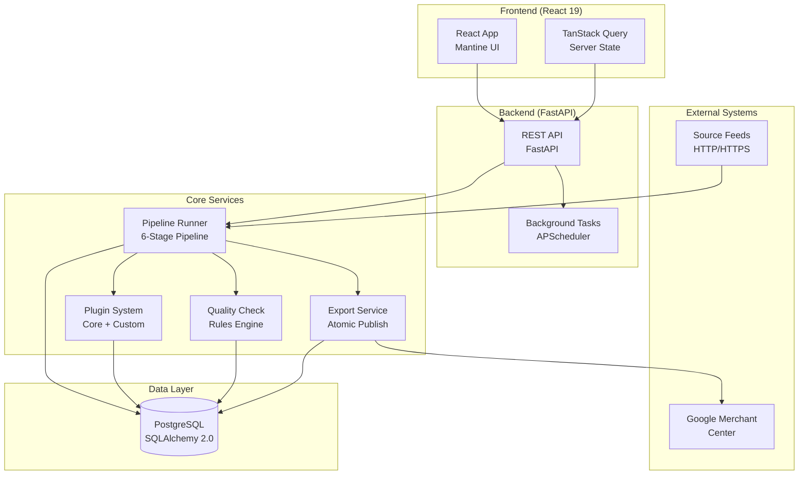

# System Architecture Overview

## High-Level Architecture

## Component Descriptions

| Layer | Component | Technology | Purpose |
|-------|-----------|------------|---------|
| **External** | Source Feeds | HTTP/HTTPS | Input product data from clients |
| | Google Merchant Center | HTTP | XML output destination |
| **Frontend** | React App | React 19, Mantine 9 | User interface |
| | TanStack Query | TanStack Query v5 | Server state management |
| **Backend** | REST API | FastAPI | HTTP endpoints |
| | Background Tasks | APScheduler | Scheduled pipeline runs |
| **Services** | Pipeline Runner | Python | 6-stage data processing pipeline |
| | Plugin System | Python | Extensible processing modules |
| | Quality Check | Python | Data validation rules |
| | Export Service | Python | XML generation and publish |
| **Data** | PostgreSQL | SQLAlchemy 2.0 | Persistent storage |

## Data Flow

1. **Ingestion**: Source feeds fetched via HTTP/HTTPS with Basic Auth
2. **Processing**: 6-stage pipeline (Ingest → Mapping → Staging → Plugins → QC → Export)
3. **Storage**: Delta detection via content_hash + config_hash in PostgreSQL
4. **Export**: Atomic publish to temp file → os.replace for Google Merchant Center

## Related Documentation

- [Backend Architecture](../backend/docs/architecture.md) - Pipeline details, delta mechanics
- [Frontend Architecture](../frontend/docs/architecture.md) - React stack, routing, state management
- [Data Model](../backend/docs/data-model.md) - Entity relationships, retention rules
