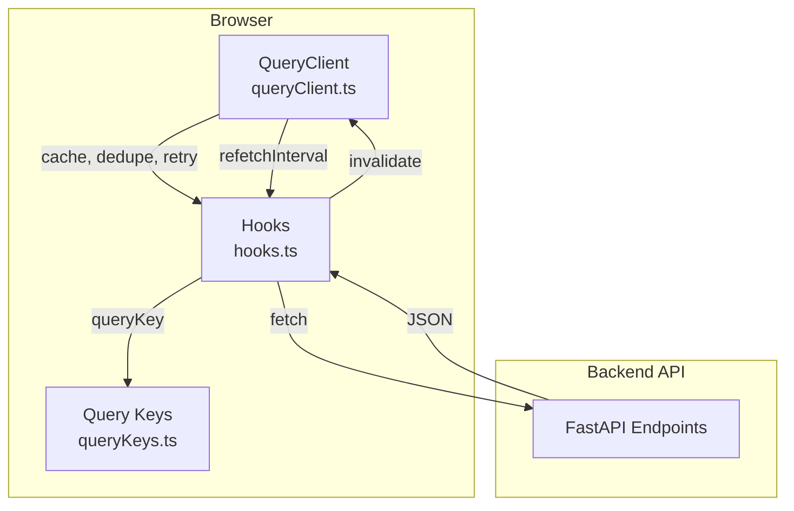

# Frontend Architecture

## Stack
| Layer | Technology |
|-------|------------|
| Framework | React 19 + TypeScript |
| Build | Vite 8 (Rolldown bundler; vendor chunks via build.rolldownOptions.output.codeSplitting.groups) |
| UI Library | Mantine 9 |
| Server State | TanStack Query v5 |
| Tables | TanStack Table v9 |
| Forms | TanStack Form v1 (core) + custom JsonSchemaForm (plugin schemas) |
| Drag & Drop | dnd-kit |
| Routing | React Router v7 |
| i18n | i18next (HTTP backend, browser detector) |
| Testing | Vitest + React Testing Library |

## Server State Strategy (TanStack Query)



### Query Key Structure (`src/api/queryKeys.ts`)
```typescript
queryKeys = {
  session: ['session'],
  dashboardSummary: ['dashboard', 'summary'],
  clients: ['clients'],
  plugins: ['plugins'],
  registryAttributes: ['registry', 'attributes'],
  productDetail: (feedSourceId, productId) => ['feed-source', feedSourceId, 'products', 'detail', productId],
  feedSource: (id) => ({
    detail: ['feed-source', id],
    products: (params) => ['feed-source', id, 'products', params],
    pipeline: ['feed-source', id, 'pipeline'],
    runs: ['feed-source', id, 'runs'],
    findings: ['feed-source', id, 'findings'],
    exportHistory: ['feed-source', id, 'export-history'],
    exportDiff: (params | undefined) => ['feed-source', id, 'export-diff', params ?? { disabled: true }],
    fieldMapping: ['feed-source', id, 'field-mapping'],
    mapping: ['feed-source', id, 'field-mapping'],   // alias of fieldMapping
    fields: ['feed-source', id, 'fields'],
  }),
  pluginConfig: (pluginId, scope) => ['plugin-config', pluginId, scope ?? {}],
  pluginData: (pluginId, scope) => ['plugin-data', pluginId, scope ?? {}],
}
```

### Polling & Invalidation (`src/api/hooks.ts`)
| Hook | Polling | Invalidation Trigger |
|------|---------|---------------------|
| `useDashboardSummary` | 5s if any run `running`, else 30s | — |
| `useIngestionRuns` | 5s if `active=true` | Manual run, dry run |
| `useQualityFindings` | 5s if `active=true` | Pipeline completion |
| `useRunDryRun` | — | Invalidates `runs` + `findings` |
| `useRotateExportToken` | — | Invalidates `feedSource.detail` |
| `useSavePipeline` | — | Invalidates `feedSource.pipeline` |
| `usePatchPipelineInstance` | — | Invalidates `feedSource.pipeline` (on success and failure — failure refetches to roll back the optimistic toggle) |
| `useUpdatePluginEnabled` | — | Invalidates `plugins` (global registry toggle) |
| `useRollbackToVersion` | — | Invalidates `feedSource.exportHistory` + `export-diff` (prefix) |

**Rule**: All server state in TanStack Query. **No duplicate stores** (Zustand, Redux, Context for server data).

### Mutation Pattern
```typescript
export function useSavePipeline(feedSourceId) {
  const queryClient = useQueryClient();
  return useMutation({
    mutationFn: (doc) => apiPut(`/feed-sources/${feedSourceId}/pipeline`, doc),
    onSuccess: () => {
      queryClient.invalidateQueries({ queryKey: queryKeys.feedSource(feedSourceId).pipeline });
    },
  });
}
```

## Client State (React Built-ins Only)
- `useState` / `useReducer` for form drafts, UI toggles, pipeline builder workspace
- `Context` for: theme, notifications, i18n, session (auth state via TanStack Query)
- **No global store library** (Zustand, Redux, Jotai, etc.)

## Routing (`src/app/router.tsx`)

```
/
├── /login
└── (RequireSession) → AppShell
    ├── /                                    → DashboardPage
    ├── /clients/:clientId/feeds/:feedSourceId          → FeedDashboardPage (feed index)
    ├── /clients/:clientId/feeds/:feedSourceId/setup          → SetupPage
    ├── /clients/:clientId/feeds/:feedSourceId/products       → ProductsPage
    ├── /clients/:clientId/feeds/:feedSourceId/pipeline       → PipelinePage
    ├── /clients/:clientId/feeds/:feedSourceId/monitoring/
    │   ├── /runs                           → MonitoringRunsPage
    │   ├── /findings                       → MonitoringFindingsPage
    │   └── /dry-run                        → MonitoringDryRunPage
    ├── /clients/:clientId/feeds/:feedSourceId/export         → ExportPage
    ├── /clients/:clientId/feeds/:feedSourceId/plugins/:pluginId  → PluginPage (feed scope)
    ├── /clients/:clientId/plugins/:pluginId                  → PluginPage (client scope)
    ├── /plugins/:pluginId                                    → PluginPage (global scope)
    ├── /admin                           → AdminPage (Users tab, RequireAdmin)
    │   ├── /admin/users                 → AdminPage (Users tab)
    │   ├── /admin/clients               → AdminPage (Clients tab)
    │   ├── /admin/settings              → AdminPage (Settings tab)
    │   └── /admin/ai                    → AdminPage (AI tab: providers + settings + prompt library + usage)
    ├── /logs                               → SystemLogsPage (RequireAdmin; filterable cursor-paginated event log viewer)
    ├── /rules                              → GlobalRulesPage (placeholder)
    └── *                                 → NotFoundPage
```

- **Lazy loading** for all feature pages (`React.lazy` + `Suspense`)
- **Session guard**: `RequireSession` redirects to `/login` on 401
- **Admin guard**: `RequireAdmin` redirects non-admins (session `role !== 'admin'`) away from `/admin/*` and `/logs`
- **Unauthorized handler**: Clears session queries, redirects with `from` state

## Admin Area & Role-aware UI

- Session shape (`GET /auth/me`): `{username, role: 'admin' | 'user', client_ids: number[] | null}` (`null` = admin/unrestricted). Server state via `useSession` only (ADR-0001).
- Single "Admin" NavLink in `AppShell` renders only for admins and links to `/admin`; `AdminPage` is one page with URL-driven Mantine tabs (Users, Clients, Settings; `keepMounted={false}`, so only the active tab's queries fire). The AI tab is sectioned (Providers, Settings, Prompt Library, Usage) via a SegmentedControl; **Settings** (`AiSettingsPage`) edits the hot-applied AI runtime knobs and shows cache status/stats/clear, with the backend selector disabled when Redis is provided by the environment. The sub-paths `/admin/users|clients|settings` preselect the tab. Dashboard shows a "Manage clients" link for admins instead of inline client CRUD.
- `AdminClientsPage` — Clients tab panel: client CRUD moved here from the dashboard (now read-only listing for everyone); the dashboard's `ClientModal`/`DeleteClientModal` components are reused there.
- `AdminUsersPage` — Users tab panel: user table (role badge, assigned-client count, active switch), create/edit modal with role select + client multi-select, reset-password modal.
- `AdminSettingsPage` — Settings tab panel: editable retention days (`/admin/settings`), scheduler job overview (`/admin/scheduler`), plugin enable/disable toggles (reuses `useUpdatePluginEnabled`).
- **AI provider wizard** — `features/admin/ai/ProviderWizard.tsx` is a 3-step Mantine `Stepper` (provider preset → API key → model) backed by `useProviderPresets()` and `useModelCatalog(vendor)`; advanced fields (tier, concurrency, timeout, prices, enabled) sit in a collapsed accordion and prices prefill from the selected catalog entry. `ProvidersPage.tsx` keeps the provider table (Legacy badge for `openai_compatible` rows) and shows the catalog sync status with a manual refresh button. Presets and catalog are server state and live only in TanStack Query.
- Backend enforces the same rules (404 for unassigned client/feed-source access, 403 for admin-only operations, `/admin/*` admin-only) — the frontend guard is UX only.

## Logging & Error Reporting

- **Logger util** (`src/logging/logger.ts`, no dependency): `createLogger(scope)` returns `debug`/`info` (console only) and `warn`/`error` (console **and** queued for shipping). `captureException(error, context)` reports an unknown throw; `installGlobalErrorHandlers()` wires `window.onerror`, `unhandledrejection`, `pagehide`, and `visibilitychange`.
- **Redaction mirrors the backend**: key denylist (`password`, `token`, `secret`, `authorization`, `api_key`, …) → `[REDACTED]`, string values > 2000 chars truncated, recursion depth 3.
- **Shipping**: `warn`/`error` entries batch on size (10) and interval (5 s) and POST to `/logs/client` via `navigator.sendBeacon`, falling back to `fetch(..., { keepalive: true, credentials: 'include' })`. `flushLogs()` forces a flush; `resetLogQueue()` clears (tests).
- **Correlation**: `src/api/client.ts` attaches `X-Request-ID` (`crypto.randomUUID()`) to every request; a failed response logs an `api` error carrying that id, the method, the query-stripped URL, and the status. Frontend-only errors mint a local id, so every shipped entry has a `request_id`. Context: `request_id`, route, url path, truncated userAgent — no PII.
- **Top-level boundary**: `AppErrorBoundary` (`src/app/AppErrorBoundary.tsx`) wraps `<App/>` in `src/App.tsx` and reports via `captureException`; `PluginErrorBoundary` keeps its per-plugin isolation role (ADR-0004) and additionally reports through the logger.
- **Admin viewer**: `/logs` → lazy `SystemLogsPage` (`features/systemLogs/`), gated by `RequireAdmin` and hidden from the non-admin nav. Read-only Mantine table over `useEventLogs` (`GET /logs/entries`), with category/level/source/actor/request-id/message filters, a row-expand detail (`JSON.stringify(entry)`), and "load more" cursor pagination. Server state lives only in TanStack Query (`queryKeys.eventLogs`).

## State Boundaries

| Data | Location | Mutation |
|------|----------|----------|
| User session | TanStack Query (`useSession`) | `login`/`logout`/`password` mutations |
| Clients, feed sources | TanStack Query | `create`/`update`/`delete` mutations |
| Pipeline definition | TanStack Query (`useFeedSourcePipeline`) | `useSavePipeline` (Save), `usePatchPipelineInstance` (per-instance enable) |
| Field mapping | TanStack Query (`useFieldMapping`) | `useSaveFieldMapping` / `useAutoMap` |
| Plugin config/data | TanStack Query (`usePluginConfig`) | `useSavePluginConfig` / `useSavePluginData` |
| Products (paginated) | TanStack Query (`useProductList`) | — (read-only from staging) |
| Quality findings | TanStack Query (`useQualityFindings`) | — (read-only from QC) |
| Export history | TanStack Query (`useExportHistory`) | `useRollbackToVersion` |
| Pipeline builder workspace | **Local React state** (`PipelinePage` `LocalInstance[]`) | Drag/drop reorder, add/remove instances, config edits, toggles on unsaved instances (saved instances persist via PATCH immediately) |
| Chat conversation | **Local React state** (`ChatWidget` `ChatMessage[]`) | `useChat` mutation — the client sends the full conversation array on every request (server is stateless) |
| Form drafts (plugin UIs) | **Local React state** (`PluginPage`) | `onChange` → local, `onSubmit` → mutation |
| Notifications | `src/app/notifications.ts` (Mantine `Notifications` provider) | `notifySuccess` / `notifyApiError` |

## Key Components

### Chat Widget (`src/features/chat/ChatWidget.tsx`)
- Mounted in the `AppShell` header (between color-scheme toggle and user menu) — available on every page for any authenticated user
- Mantine `Drawer` opened by the header icon; scope badge shows admin vs client-scoped data visibility from `useSession`
- Conversation history is component-local `useState` (client state — not server state, not cached); `useChat` posts the full array to `POST /chat` per turn; clear button resets it
- Enter sends (Shift+Enter = newline); mutation errors render as an inline `Alert`, never a blocking modal

### Pipeline Builder (`src/features/pipeline/`) — master-detail layout
- `PipelinePage` — container; local instance state (`LocalInstance` = `PipelineInstance` + position-based `clientId`), dirty tracking (`isInstancesEqual` vs server snapshot), `useBlocker` navigation guard with `ConfirmModal`
  - Layout: `PipelineOverviewStrip` on top, `PluginList` left (`Grid.Col span={4}`), `PluginConfigPanel` right (`Grid.Col span={8}`)
  - Save (PUT) persists the full local array — reorder, add, remove, and config edits in one request; Reset restores the server snapshot; unsaved-instance toggles also flush on Save
  - **Per-instance enable is immediate-persist**: the Switch PATCHes `enabled` for saved instances (optimistic; on failure rolls back the whole local array snapshot and invalidates the pipeline query to refetch); unsaved instances (no `id` yet) flip locally and persist with Save
- `PipelineOverviewStrip` — total/enabled/disabled counters + dirty badge
- `PluginList` — master list; owns the dnd-kit `DndContext`/`SortableContext` (row reorder via drag handles), per-instance enable switches (`plugin-toggle-*`), add-from-registry (`add-plugin-*`), global registry toggles (registry section, `registry-toggle-*` → `useUpdatePluginEnabled`)
- `PluginConfigPanel` — detail panel; embeds the plugin's registered custom UI inside a tier switcher (Feed / Client / Global) when the plugin has a custom component, plus the JSON-schema instance-settings form for the selected instance (internal draft, keyed remount on selection change), remove button
- `dndUtils` — pure helpers: `addInstance` / `reorderInstances` / `applyDragEnd` / `removeInstance` / `isInstancesEqual`

### Plugin System (`src/features/plugin/`)
- `PluginPage` — renders plugin config/data form
  - Schema from `plugin.manifest.config_schema`
  - Auto-rendered via `JsonSchemaForm` (custom Mantine renderer)
  - Custom component via `manifest.frontend.component` (build-time import)
  - Registry map in `src/features/plugin/customComponents.ts` — keyed by plugin id (currently `rules` → `RulesUI`, `filter` → `FilterUI`, `custom_labels` → `CustomLabelsUI`)
  - Fallback: if plugin id has no registry entry, renders schema form
- **Navigation**: The sidebar is scope-swapped. In global scope (no feed selected) it shows Fleet Overview (`/`), Clients (`/#clients`), Global Rules (`/rules`), plus the Admin entry and System Logs (`/logs`) for admins only. In feed scope it shows Dashboard (the exact feed base route), then Setup, plugin entries (enabled plugins with `manifest.frontend.component`), Products, Pipeline, Monitoring, Export. The header feed dropdown (FeedBreadcrumb) switches between the client's feed sources and offers an "All clients" reset to `/`. Plugin entries appear only in feed context and are labeled via `pluginNames.*` i18n keys with `plugin.name` as fallback, with icons resolved via `getPluginIcon`. Each plugin has two surfaces (ADR-0007): its Plugin Page (dashboard/tool) and its Setup surface embedded in the Pipeline Editor — `PluginConfigPanel` embeds the plugin's registered Setup component from `CONFIG_COMPONENTS` (`src/features/plugin/configComponents.ts`) with a tier switcher (Feed / Client / Global); plugins with only a custom page component show a hint and an "Open plugin page" link in the panel. Plugin routes (`/plugins/:id`, `/clients/:c/plugins/:id`, `/clients/:c/feeds/:f/plugins/:id`) remain as deep links (ScopeContextBar tier hrefs, bookmarks).
- **Plugin UIs with custom components**:
  - `rules` → `RulesUI` (`src/features/rules/`) — ordered rule list with dnd reordering, master pinning, i18n (`rules` namespace)
  - `filter` → `FilterUI` (`src/features/filter/`) — conjunctive scalar condition editor with live preview, dirty-guard + useBlocker, i18n (`filter` namespace)
  - `custom_labels` → `CustomLabelsUI` (`src/features/customLabels/`, UI name "Labelizer") — merged Global/Client/Feed tier view (union-by-id mirroring the runtime `config_merge`); the bulk tab is slot-selected via a top SegmentedControl (custom_label_0..4) with a coverage dashboard (any-slot labeled/total, progress bar, quick stats) and collapsible priority-ordered rule cards (matched + overridden badges, shadowed-value list with attribution tooltips), debounced draft preview via `POST /plugins/custom_labels/preview`; rule duplicate/delete, override-at-client-level, clickable tier navigation, help drawer; expanded rule cards at feed tier add a synchronized, windowed product preview column beside the value list (batch lookup via `POST /feed-sources/{id}/products/lookup`), i18n (`customLabels` namespace)
- All three custom components share the pattern: dirty-guard + `useBlocker` navigation guard with `ConfirmModal`, `useSavePluginConfig` mutation for editable-tier writes

### Shared Dashboard Primitives (`src/components/dashboard/`)
- `StatCard` — KPI card with number formatting and neutral/warning/critical variants; consumed by both the fleet dashboard and the feed dashboard
- `ChartCard` — Paper + title + structural empty-state branch; all dashboard charts render inside it
- `dashboardColors` — semantic series colors (success/error/warning/info/raw/exportable/passed/dropped) and the 8-color donut palette; single source so fleet and feed charts cannot drift

### Quality Findings (`src/features/monitoring/` + `src/features/monitoring/findings/`)
- `findings/` — the shared findings domain module: `severity.ts` (order, colors, labels), `ruleCatalog.ts` (rule-code → title/description/remediation, with a backend-`rule_id` guard test), `groupFindings.ts` (group/count/filter helpers), `SeverityBadge`/`RuleLabel`/`FindingsSummary`, `FindingsExplorer`, and the `QualityTrendChart`/`RuleDistributionChart` charts
- `MonitoringFindingsPage` — composes `FindingsSummary` (severity counts with run-over-run `↓ fixed` / `↑ new` delta badges when a previous run exists), both charts, `FindingsExplorer` (group by rule or GMC attribute, collapsible groups, free-text search, severity/rule filters, flat sortable + paginated table) and a `ProductDrawer` for finding → product drill-down
- `FindingsTable` — shared flat findings table (sortable, paginated, optional product drill-down) used by the explorer and the dry-run results
- `MonitoringRunsPage` — `IngestionRunsTable` with polling
- `MonitoringDryRunPage` — trigger dry run, show `DryRunResults`

Charts use `@mantine/charts@9.5.2` (peer `recharts`); styles imported in `src/App.tsx`. The delta counters come from the extended `quality-findings` response; the trend chart consumes `GET /feed-sources/{id}/quality-history` via `useQualityHistory`. The fleet dashboard feed cards show a `quality` badge (critical, else warning) from `GET /dashboard/summary` and link into the feed's findings page; the feed dashboard's quality chart links there too.

### Export (`src/features/export/`)
- `ExportPage` — `ExportVersionList` + `ExportVersionDiff` + `RollbackConfirmModal`

### Setup (`src/features/setup/`)
- `SetupPage` — tabs: Feed Settings, Field Mapping, Export URL
- `FeedSettingsForm` — writes only changed keys to `PUT /feed-sources/{id}`; `configuration` updates are merged (`basic_auth`, and since Z3 `ai_qc: {enabled, budget}` from the AI quality-check switch + budget input) so unrelated config keys are preserved
- `MappingTab` — `MappingTable` (TanStack Table; observed rows + custom rows with add/remove, shadow indicator for observed/custom overlap) + auto-map button (the only automap trigger — pipeline runs and dry-runs never auto-match; custom source fields are dormant until the feed supplies the key)

## Development Setup
```bash
# Generate certs (once)
mkdir -p local-certs
openssl req -x509 -newkey rsa:2048 -nodes \
  -keyout local-certs/localhost-key.pem \
  -out local-certs/localhost-cert.pem \
  -days 365 -subj "/CN=localhost" \
  -addext "subjectAltName=DNS:localhost,IP:127.0.0.1"

# .env.local  (see .env.example for the canonical list)
VITE_HTTPS_CERT=local-certs/localhost-cert.pem
VITE_HTTPS_KEY=local-certs/localhost-key.pem
VITE_ALLOWED_HOSTS=localhost

# Dev servers
cd backend && uv run uvicorn app.main:app --host 127.0.0.1 --port 8000 --workers 1
cd frontend && npm run dev
# Open https://localhost:5173
```

- `.env.example` is the canonical list of frontend env vars; copy it to `.env.local` (gitignored). `VITE_ALLOWED_HOSTS` is comma-separated — Vite rejects any Host header not listed, so reaching the dev server by hostname means adding it here.
- To serve the app through Caddy instead, run `make dev-caddy` (HTTP, no TLS) and set `DEV_HOST` to the same host. The two knobs are deliberately paired: `VITE_ALLOWED_HOSTS` governs Vite, `DEV_HOST` governs Caddy's site label.

- Vite proxies `/auth/*`, `/health`, `/admin`, `/clients`, `/feed-sources`, `/dashboard`, `/plugins`, `/registry`, `/export`, `/logs`, `/chat` to `VITE_API_TARGET` (default `http://127.0.0.1:8000`; set it in `.env` to match a backend on another port) — production Caddyfiles mirror this proxy list, including `/admin/*`
- `/chat`, `/logs/*`, and the rest of the list above are proxied by both Caddyfiles and the Vite dev server, so the chat widget and the logger/viewer reach the backend under `npm run dev` and through Caddy.
- HTTPS required for `Secure` session cookie

## Key Files
- `src/main.tsx` — App entry, providers, global error handlers
- `src/App.tsx` — MantineProvider, LocaleProvider, Suspense
- `src/app/AppErrorBoundary.tsx` — top-level render-error boundary (reports via `captureException`)
- `src/logging/logger.ts` — custom logger, redaction, error shipping, `X-Request-ID` generator
- `src/app/router.tsx` — Routes, session guard, lazy loading
- `src/api/queryClient.ts` — QueryClient config (no retry, no background refetch)
- `src/api/queryKeys.ts` — Hierarchical query key factory
- `src/api/hooks.ts` — All data fetching + mutation hooks
- `src/api/client.ts` — `apiGet`/`apiPost`/`apiPut`/`apiPatch`/`apiDelete` with cookie handling
- `src/api/fieldOptions.ts` — Single option-building authority: `FieldDescriptor` adapters (`fromSourceFields`, `fromRegistryAttributes`), `buildFieldOptions` (grouped + 1-based indexed expansion for `repeated_*` kinds), `INDEXED_PATH_REGEX` (client-side free-text validation, operator directive 4)
- `src/components/FieldSelect.tsx` — Shared field picker (Mantine Combobox + InputBase; grouped options, free-text entry with 1-based validation, clearable). All four pickers (MappingTable, MatchFieldCombobox, RulesUI/RuleEditor, FilterUI) consume it over registry-with-feed-context (`useRegistryAttributes(scope.feedSourceId)`) so their lists are identical; run-triggering mutations (`useTriggerRun`, `useRunDryRun`) invalidate the `['registry', 'attributes']` query-key prefix (operator directive 3)
- `src/components/JsonSchemaForm.tsx` — Mantine-themed schema form renderer
- `src/components/StateViews.tsx` — `LoadingState`, `ErrorState`, `EmptyState`
