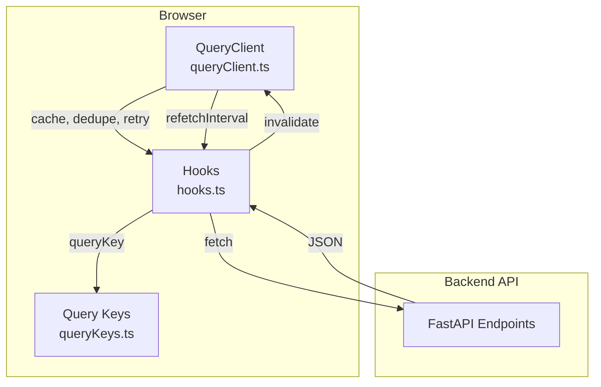

# Frontend Architecture

## Stack
| Layer | Technology |
|-------|------------|
| Framework | React 19 + TypeScript |
| Build | Vite 6 (esbuild dev, Rollup prod) |
| UI Library | Mantine 9 |
| Server State | TanStack Query v5 |
| Tables | TanStack Table v9 |
| Forms | TanStack Form v1 (core) + RJSF (plugin schemas) |
| Drag & Drop | dnd-kit |
| Routing | React Router v7 |
| i18n | i18next (HTTP backend, browser detector) |
| Testing | Vitest + React Testing Library |

## Server State Strategy (TanStack Query)



### Query Key Structure (`src/api/queryKeys.ts`)
```typescript
queryKeys = {
  session: ['session'],
  dashboardSummary: ['dashboard', 'summary'],
  clients: ['clients'],
  plugins: ['plugins'],
  registryAttributes: ['registry', 'attributes'],
  feedSource: (id) => ({
    detail: ['feed-source', id],
    products: (params) => ['feed-source', id, 'products', params],
    pipeline: ['feed-source', id, 'pipeline'],
    runs: ['feed-source', id, 'runs'],
    findings: ['feed-source', id, 'findings'],
    exportHistory: ['feed-source', id, 'export-history'],
    exportDiff: (params | undefined) => ['feed-source', id, 'export-diff', params ?? { disabled: true }],
    fieldMapping: ['feed-source', id, 'field-mapping'],
  }),
  pluginConfig: (pluginId, scope) => ['plugin-config', pluginId, scope],
  productDetail: (feedSourceId, productId) => ['feed-source', feedSourceId, 'products', 'detail', productId],
}
```

### Polling & Invalidation (`src/api/hooks.ts`)
| Hook | Polling | Invalidation Trigger |
|------|---------|---------------------|
| `useDashboardSummary` | 5s if any run `running`, else 30s | — |
| `useIngestionRuns` | 5s if `active=true` | Manual run, dry run |
| `useQualityFindings` | 5s if `active=true` | Pipeline completion |
| `useRunDryRun` | — | Invalidates `runs` + `findings` |
| `useRotateExportToken` | — | Invalidates `feedSource.detail` |
| `useSavePipeline` | — | Invalidates `feedSource.pipeline` |
| `useRollbackToVersion` | — | Invalidates `feedSource.exportHistory` + `export-diff` (prefix) |

**Rule**: All server state in TanStack Query. **No duplicate stores** (Zustand, Redux, Context for server data).

### Mutation Pattern
```typescript
export function useSavePipeline(feedSourceId) {
  const queryClient = useQueryClient();
  return useMutation({
    mutationFn: (doc) => apiPut(`/feed-sources/${feedSourceId}/pipeline`, doc),
    onSuccess: () => {
      queryClient.invalidateQueries({ queryKey: queryKeys.feedSource(feedSourceId).pipeline });
    },
  });
}
```

## Client State (React Built-ins Only)
- `useState` / `useReducer` for form drafts, UI toggles, pipeline builder workspace
- `Context` for: theme, notifications, i18n, session (auth state via TanStack Query)
- **No global store library** (Zustand, Redux, Jotai, etc.)

## Routing (`src/app/router.tsx`)

```
/
├── /login
└── (RequireSession) → AppShell
    ├── /                                    → DashboardPage
    ├── /clients/:clientId/feeds/:feedSourceId/setup          → SetupPage
    ├── /clients/:clientId/feeds/:feedSourceId/products       → ProductsPage
    ├── /clients/:clientId/feeds/:feedSourceId/pipeline       → PipelinePage
    ├── /clients/:clientId/feeds/:feedSourceId/monitoring/
    │   ├── /runs                           → MonitoringRunsPage
    │   ├── /findings                       → MonitoringFindingsPage
    │   └── /dry-run                        → MonitoringDryRunPage
    ├── /clients/:clientId/feeds/:feedSourceId/export         → ExportPage
    ├── /clients/:clientId/plugins/:pluginId                  → PluginPage
    └── /plugins/:pluginId                                    → PluginPage (global scope)
```

- **Lazy loading** for all feature pages (`React.lazy` + `Suspense`)
- **Session guard**: `RequireSession` redirects to `/login` on 401
- **Unauthorized handler**: Clears session queries, redirects with `from` state

## State Boundaries

| Data | Location | Mutation |
|------|----------|----------|
| User session | TanStack Query (`useSession`) | `login`/`logout`/`password` mutations |
| Clients, feed sources | TanStack Query | `create`/`update`/`delete` mutations |
| Pipeline definition | TanStack Query (`useFeedSourcePipeline`) | `useSavePipeline` |
| Field mapping | TanStack Query (`useFieldMapping`) | `useSaveFieldMapping` / `useAutoMap` |
| Plugin config/data | TanStack Query (`usePluginConfig`) | `useSavePluginConfig` / `useSavePluginData` |
| Products (paginated) | TanStack Query (`useProductList`) | — (read-only from staging) |
| Quality findings | TanStack Query (`useQualityFindings`) | — (read-only from QC) |
| Export history | TanStack Query (`useExportHistory`) | `useRollbackToVersion` |
| Pipeline builder workspace | **Local React state** (`PipelineWorkspace`) | Drag/drop, instance config edits |
| Form drafts (plugin UIs) | **Local React state** (`PluginPage`) | `onChange` → local, `onSubmit` → mutation |
| Notifications | `src/app/notifications.ts` (Mantine `Notifications` provider) | `notifySuccess` / `notifyApiError` |

## Key Components

### Pipeline Builder (`src/features/pipeline/`)
- `PipelinePage` — container, fetches pipeline + plugins
- `PipelineWorkspace` — dnd-kit `SortableContext`, dirty tracking
- `PluginPalette` — available enabled plugins (draggable)
- `PipelineInstanceCard` — configured instance (draggable, editable config)

### Plugin System (`src/features/plugin/`)
- `PluginPage` — renders plugin config/data form
  - Schema from `plugin.manifest.config_schema`
  - Auto-rendered via `JsonSchemaForm` (RJSF-style custom impl)
  - Custom component via `manifest.frontend.component` (build-time import)

### Quality Dashboard (`src/features/monitoring/`)
- `MonitoringRunsPage` — `IngestionRunsTable` with polling
- `MonitoringFindingsPage` — `FindingsTable` grouped by severity/rule
- `MonitoringDryRunPage` — trigger dry run, show `DryRunResults`

### Export (`src/features/export/`)
- `ExportPage` — `ExportVersionList` + `ExportVersionDiff` + `RollbackConfirmModal`

### Setup (`src/features/setup/`)
- `SetupPage` — tabs: Feed Settings, Field Mapping, Export URL
- `MappingTab` — `MappingTable` (TanStack Table) + auto-map button

## Development Setup
```bash
# Generate certs (once)
mkdir -p local-certs
openssl req -x509 -newkey rsa:2048 -nodes \
  -keyout local-certs/localhost-key.pem \
  -out local-certs/localhost-cert.pem \
  -days 365 -subj "/CN=localhost" \
  -addext "subjectAltName=DNS:localhost,IP:127.0.0.1"

# .env.local
VITE_HTTPS_CERT=local-certs/localhost-cert.pem
VITE_HTTPS_KEY=local-certs/localhost-key.pem

# Dev servers
cd backend && uv run uvicorn app.main:app --host 127.0.0.1 --port 8000 --workers 1
cd frontend && npm run dev
# Open https://localhost:5173
```

- Vite proxies `/auth/*`, `/health`, `/clients`, `/feed-sources`, `/dashboard`, `/plugins`, `/registry`, `/export` to `http://127.0.0.1:8000`
- HTTPS required for `Secure` session cookie

## Key Files
- `src/main.tsx` — App entry, providers
- `src/App.tsx` — MantineProvider, LocaleProvider, Suspense
- `src/app/router.tsx` — Routes, session guard, lazy loading
- `src/api/queryClient.ts` — QueryClient config (no retry, no background refetch)
- `src/api/queryKeys.ts` — Hierarchical query key factory
- `src/api/hooks.ts` — All data fetching + mutation hooks
- `src/api/client.ts` — `apiGet`/`apiPost`/`apiPut`/`apiDelete` with cookie handling
- `src/components/JsonSchemaForm.tsx` — Mantine-themed schema form renderer
- `src/components/StateViews.tsx` — `LoadingState`, `ErrorState`, `EmptyState`
